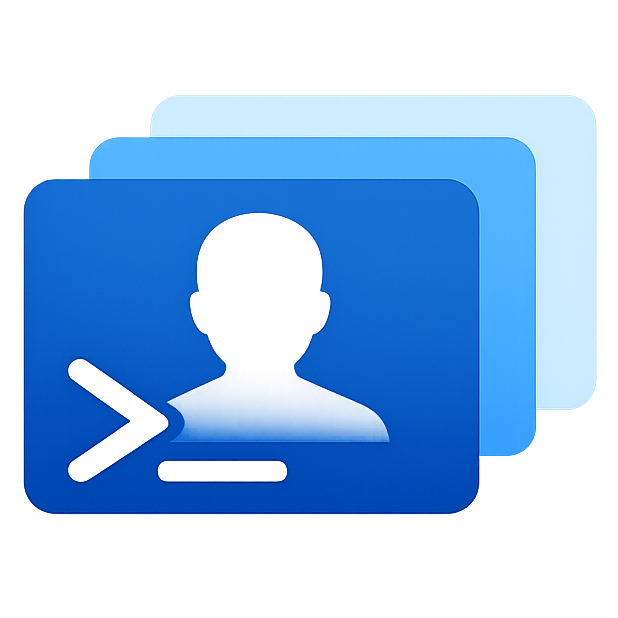

<div align="center">



# ProfileX

Profile manager for **Claude Code** and **OpenAI Codex CLI**.

[](https://github.com/derekurban/profilex-cli/actions/workflows/ci.yml)
[](https://github.com/derekurban/profilex-cli/releases)
[](LICENSE)

</div>

ProfileX gives each tool its own isolated config directory per profile, and generates shims like `claude-work` and `codex-personal` so you can switch between accounts instantly.

---

## Why

Neither Claude Code nor Codex provides built-in multi-account support. ProfileX solves this by redirecting each tool's native config directory:

- Claude Code → `CLAUDE_CONFIG_DIR`
- Codex CLI → `CODEX_HOME`

Each profile gets its own isolated directory. Auth happens naturally through the tool's normal flow on first run.

---

## Install

### One-command install (recommended)

```bash
curl -fsSL https://raw.githubusercontent.com/derekurban/profilex-cli/main/install.sh | bash
```

For Windows PowerShell:

```powershell
irm https://raw.githubusercontent.com/derekurban/profilex-cli/main/install.ps1 | iex
```

### npm

```bash
npm i -g profilex-cli
```

### From source

```bash
go install github.com/derekurban/profilex-cli@latest
```

### Installer options

Environment variables:

- `PROFILEX_INSTALL_DIR` (default: `~/.local/bin`)
- `PROFILEX_VERSION` (`latest` by default, or tag like `v0.1.0`)
- `PROFILEX_AUTO_PATH` (`1` by default; set `0` to disable PATH updates)
- `PROFILEX_VERIFY_SIGNATURES` (`1` by default; set `0` to disable cosign verification)
- `PROFILEX_ALLOW_SOURCE_FALLBACK` (`0` by default; set `1` to allow `go install` fallback)

---

## Quick start

```bash
# Create profiles
profilex add claude personal
profilex add claude work
profilex add codex main

# Set defaults
profilex use claude work

# List profiles with auth status
profilex list

# Use the shims directly
claude-personal
claude-work
codex-main
```

After creating a profile, just run the shim (e.g. `claude-work`). You'll be prompted to authenticate on first use.

By default, new profiles share session/history storage per tool:

- Claude profiles link `<profile>/projects` to `~/.profilex/shared/claude/projects`
- Codex profiles link `<profile>/sessions` to `~/.profilex/shared/codex/sessions`

Use `--isolated` with `profilex add` to opt out for a profile.

---

## Commands

- `profilex add <tool> <profile> [--isolated]` — Create profile + install shim
- `profilex remove <tool> <profile> [--purge]` — Remove profile + shim
- `profilex uninstall [--purge]` — Uninstall profilex binary (and optionally local profilex state)
- `profilex list [--tool claude|codex] [--json]` — List profiles with status
- `profilex use <tool> <profile>` — Set default profile
- `profilex rename <tool> <old> <new>` — Rename a profile
- `profilex run <tool> [profile] -- [args...]` — Run tool with profile context
- `profilex shim install [--dir <path>]` — Reinstall all shims
- `profilex shim uninstall [--all] [<tool> <profile>]` — Remove shims
- `profilex usage export [--out <file>] [--deep]` — Export unified usage bundle for ProfileX-UI

### Unified usage export for ProfileX-UI

```bash
profilex usage export --out ./public/local-unified-usage.json --deep
```

This scans ProfileX-managed and stock Claude/Codex usage locations, normalizes events, maps them to profiles (or `default-*` buckets), and writes a single JSON bundle for ProfileX-UI.

If `openclaw` is available, it also attempts to ingest `openclaw status --json --usage` into the unified bundle.

---

## Storage

Default root: `~/.profilex` (or `PROFILEX_HOME` override)

```
~/.profilex/
├── state.json
├── profiles/
│   ├── claude/
│   │   ├── personal/
│   │   └── work/
│   └── codex/
│       └── main/
└── shared/
    ├── claude/
    │   └── projects/
    └── codex/
        └── sessions/
```

---

## Testing

```bash
go test ./...
go vet ./...
```

---

## License

MIT
